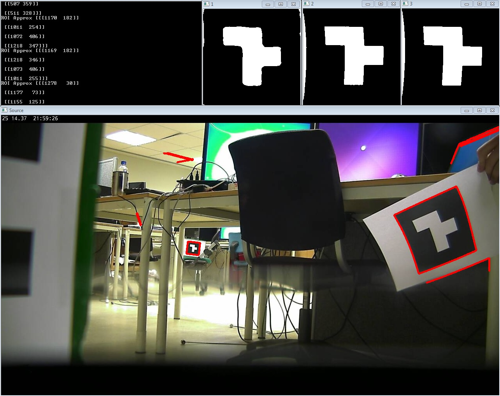

the_project
===========

Implementation for the project thesis, preliminary work before the master thesis. Mashup of various technologies.

Final purpose is to have a suite which can track and follow glyphs using PTZ camera coupled with computer vision.

Mainly developed on Windows 7, also tested on OS X.

- py_gtrack: Project Thesis delivery, glyph tracking using either CCTV or Webcam
- cpp_gsoap: PTZ ONVIF-S Implementation C++

Other archived code that the reader may find useful:

- archive\py_camsnapshot: Program to capture snapshots of cameras
- archive\py_camstream: CCTV camera streaming implementation
- archive\py_glyph: Glyph recognition implementation
- archive\py_camglyph: Combination of CCTV Camera and Glyph Recognition, realtime
- archive\py_webcamglyph: Combination of Webcam and Glyph Recognition, realtime

# Primary effort
- Implement proof-of-concept glyph tracking CCTV camera in Python

## Secondary effort
- Implement proof-of-concept in C++
- Implement PTZ controller in C++ using GSOAP, and connect to glyph tracking program
- Increase robustness and noise removal through super-resolution

Screenshot
------------
py_camglyph.py running off an AXIS CCTV Camera video stream.

Dependencies
------------
- C++ Compiler (VS 2013 Express or gcc)
- Python 2.7
- gSOAP
- ONVIF-S WSDL
- OpenSSL
- OpenCV
- Numpy